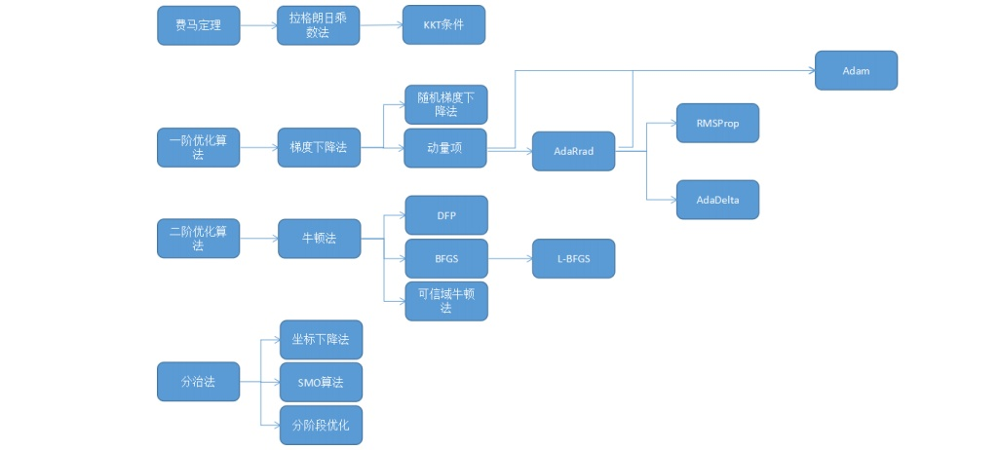

# Optimization in Machine Learning

<https://zhuanlan.zhihu.com/p/42689565>

<https://www.jianshu.com/p/0715a02f4de3?utm_campaign>

***

**规划论** Mathematical Programming(数学规划)

规划论是运筹学 (operations research) 的一个分支。

In mathematics, computer science and operations research, 
mathematical optimization or mathematical programming, 
alternatively spelled optimisation, is the selection of a best 
element (with regard to some criterion) from some set of available 
alternatives.

对于几乎所有机器学习算法，无论是有监督学习、无监督学习，还是强化学习，
最后一般都归结为求解最优化问题。因此，最优化方法在机器学习算法的推导与
实现中占据中心地位。

## 1 机器学习要求解的数学模型

几乎所有的机器学习算法最后都归结为求一个目标函数的极值，即最优化问题，
例如对于有监督学习，我们要找到一个最佳的映射函数 $ f(x) $，使得对训练
样本的损失函数最小化（最小化经验风险或结构风险）：

$$
min_w 
\lbrace
\frac{1}{N} \sum\limits_{i=1}^N L(W, x_i, y_i) + \lambda \Vert w \Vert_2^2
\rbrace
$$

对于强化学习，我们要找到一个最优的策略，即状态s到动作a的映射函数（确定
性策略，对于非确定性策略，是执行每个动作的概率）

使得任意给定一个状态，执行这个策略函数所确定的动作a之后，得到的累计回
报最大化：

这里使用的是状态价值函数。

总体来看，机器学习的核心目标是给出一个模型（一般是映射函数），然后定义
对这个模型好坏的评价函数（目标函数），求解目标函数的极大值或者极小值，
以确定模型的参数，从而得到我们想要的模型。在这三个关键步骤中，前两个是
机器学习要研究的问题，建立数学模型。第三个问题是纯数学问题，即最优化方
法，为本文所讲述的核心。

## 2 最优化算法的分类

对于形式和特点各异的机器学习算法优化目标函数，我们找到了适合它们的各种
求解算法。除了极少数问题可以用暴力搜索来得到最优解之外，我们将机器学习
中使用的优化算法分成两种类型（不考虑随机优化算法如模拟退火、遗传算法等，
对于这些算法，我们后面会专门有文章进行介绍）：

> 公式解  
> 数值优化

前者给出一个最优化问题精确的公式解，也称为解析解，一般是理论结果。后者
是在要给出极值点的精确计算公式非常困难的情况下，用数值计算方法近似求解
得到最优点。除此之外，还有其他一些求解思想，如分治法，动态规划等。我们
在后面单独列出。一个好的优化算法需要满足：

> 能正确的找到各种情况下的极值点 
> 速度快

下图给出了这些算法的分类与它们之间的关系：

## 3 费马定理

### 3.1 拉格朗日乘数法

### 3.2 KKT条件

## 4 数值优化算法

### 4.1 一阶优化算法

### 4.2 二阶优化算法

## 5 分治法 Divide and Conquer

### 5.1 坐标下降法

### 5.2 SMO 算法

### 5.3 分阶段优化

## 6 动态规划算法

动态规划也是一种求解思想，它将一个问题分解成子问题求解，如果整个问题的
某个解是最优的，则这个解的任意一部分也是子问题的最优解。这样通过求解子
问题，得到最优解，逐步扩展，最后得到整个问题的最优解。

动态规划和分治策略类似，都是通过拆分原问题为子问题，求解子问题来求解原
问题的。

隐马尔可夫模型的解码算法（维特比算法），强化学习中的动态规划算法是这类
方法的典型代表，此类算法一般是离散变量的优化，而且是组合优化问题。前面
讲述的基于导数的优化算法都无法使用。动态规划算法能高效的求解此类问题，
其基础是贝尔曼最优化原理。一旦写成了递归形式的最优化方程，就可以构造算
法进行求解。

Bellman principle of optimality

最优化原理是动态规划的基础。任何一个问题，如果失去了这个最优化原理的支
持，就不可能用动态规划方法计算。能采用动态规划求解的问题都需要满足一定
的条件：

 (1) 问题中的状态必须满足最优化原理；

 (2) 问题中的状态必须满足无后效性。

所谓的无后效性是指：“下一时刻的状态只与当前状态有关，而和当前状态之前
的状态无关，当前的状态是对以往决策的总结”。

## 7 Comparization of Dynamic Programming & Divide and conquer

都是一种 paradigm，范式，方法，思想，分析问题的模式。

动态规划和分治策略类似，都是通过拆分原问题为子问题，求解子问题来求解原
问题的。

**分治策略**将问题划分为互不相交的子问题（独立子问题），递归的求解子问
题，再将它们的解组合起来，求出原问题的街。

而**动态规划**与之相反，动态规划应用
于子问题重叠的情况，即不同的子问题具有公共的子子问题（子问题的求解释递
归进行的，将其划分为更小的子子问题）。面对重叠子问题，分支策略会做重复
的工作，会反复求解公共子子问题，而动态规划对于每个子子问题只求解一次，
将其解保存起来，从而不需重复计算求解公共子子问题，避免了大量工作。

## 8 Boundary Integral Methods

通过选取特定的integral kernel 将区域微分法转化为边界积分法.
Riemannian manifold 上的 B-M 核是调和核，适合做 harmonic analysis

* 对扰动更 robust, 调查 purturbed intergral boundary 算法的理论收敛性
* singularity on the boundary 是特别需要注意的地方
* 如何检测 singular point?
* the order of singularity
* mild sigularity and munuerical solution
* high order sigularity and numerical solution

