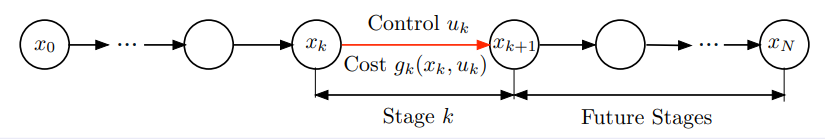

# REINFORCEMENT LEARNING AND OPTIMAL CONTROL
BOOK, VIDEOLECTURES, AND COURSE MATERIAL, 2019

Dimitri P. Bertsekas

<http://web.mit.edu/dimitrib/www/RLbook.html>

***

## 1 Finite Horizon Deterministic Problem

* System

$$
x_{k+1} = f_k(x_k, u_k), \space k=0,1,\dots, N-1
$$
where $x_k$: State, $u_k$: Control chosen from some set $U_k(x_k)$

* Cost function:

$$
g_N(x_N)+\sum_{k=0}^{N-1}g_k(x_k, u_k)
$$

* For given initial state $x_0$, minimize over control sequences $\{ u_0, \dots, u_{N-1} \}$

$$
J(x_0; u_0, \dots, u_{N-1} ) = g_N(x_N)+\sum_{k=0}^{N-1}g_k(x_k, u_k)
$$

* Optimal cost function $ J^*(x_0)=\min_{u_k\in U_k(x_k) \\ k=0, \dots, N-1} J(x_0; u_0, \dots, u_{N-1} ) $

