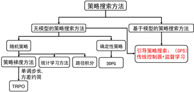
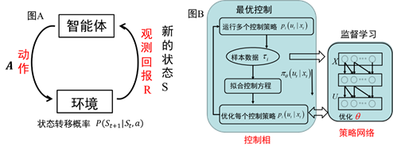

# Guided Policy Search (GPS)

1. [漫谈引导策略搜索 - A Review of Guided Policy Search](https://blog.csdn.net/philthinker/article/details/79575794)
2. [强化学习进阶 第九讲 引导策略搜索](https://zhuanlan.zhihu.com/p/26572176)

***

引导策略搜索方法（Guided Policy Search）是 Sergey Levine 在斯坦福读博士的时候提出来的 文献上最早
见于2014年 Sergey Levine 的博士论文：

> Levine S, “Motor skill learning with local trajectory methods,” PhD thesis, Stanford 
> University, 2014.

强化学习算法大神 Sergey Levine博士毕业后便去了伯克利跟着 Pieter Abbeel 做博后，出站后留在了伯克利
任教。如果查他的教育经历，会发现。Levine博士时候的老板不是搞机器人的，而是搞计算机图形学的。Levine 
读博士时，要解决的是计算机仿真中人物的逼真运动。通过模仿学习或机器学习来完成。

上图为策略搜索方法的分类，从引导策略搜索提出到现在，引导策略搜索方法其实已经扩展到了有模型和无模型的
情况。跟其他直接的策略搜索方法不同，GPS不会对策略进行直接搜索，而是将策略搜索方法分为两步：控制相和监
督相。这样有什么好处呢？这要从无模型强化学习方法的局限性说起。

TRPO 方法和 DDPG 方法都是典型的无模型强化学习方法。他们有很多优点，比如可以不对外界环境进行建模，当
外界环境十分复杂的时候，这些方法是唯一可行的方法。但是无模型的强化学习智能通过不断尝试来探索环境，这
些算法最多只能处理数百个参数的网络，对于更大的网络，这些方法的效率不高。原因很简单，当随机初始化数千
个或上万个参数的网络时，随机尝试根本就产生不了好的数据。对于复杂的任务，随机探索几乎找不到成功的解或
者好的解。没有成功的解或好的解，智能体就没办法从中学到好的动作，无法形成良性循环。也就是说，无模型的
强化学习算法最大的缺点是数据效率低。

解决无模型随机搜索问题的方法就是利用模型搜索。如何得到模型？或者从数据中学一个模型，或者人为地建立智
能体探索环境的近似模型（建机器人模型是机器人学和机器人学家们一直乐于干的事情）。有了模型之后：

1. 利用模型和基于模型的优化算法，可以得到回报高的数据，也就是好数据。
有了好的数据，我们就可以对策略网络进行稳定的训练了。
2. 有了模型，我们可以充分利用示教（Demonstration）进行学习。
人的示例可以当成模型的初值。

因此，GPS方法将策略搜索方法分成控制相和监督相。控制相通过轨迹最优、传统控制器或随机最优等方法控制产生
好的数据；监督相利用从控制相产生的好数据进行监督学习。

我们从直观上对比下我们通常的强化学习方法和GPS的方法。如下图所示，之前我们讲过，强化学习是智能体通过与
环境交互产生数据，从交互数据中学习如图A所示；而GPS是策略网络通过与控制相交互产生的数据，从控制相产生
的数据中进行学习。换句话说，在无模型中，智能体（策略网络）在通过试错跟环境学习；而GPS的方法是跟逐渐迭
代优化的控制器学习。

 

我们已经知道了GPS的基本原理，那么该如何用数学公式进而用代码来实现呢？

在进入这个问题之前，我们先看看自从GPS算法提出来以后，这些年如何发展的。其包含的具体方法有多种，可以从
三个方面来了解GPS的发展:

* **从问题的构建来看**：GPS 历经了基于重要性采样的GPS(ISCPS) ―― 基于变分推理的GPS(vGPS) ―― 基于约
束的GPS(cGPS) 。

* **从优化的方法来看**：cGPS 经历了 Dual GPS（对偶梯度下降法，2014）―― BADMM（布雷格曼交叉方向乘子
法，2015）―― Mirror Descent GPS（镜像下降优化算法）。

* **从控制相来看**：GPS从基于轨迹最优（微分动态规划DDP、线性二次规划LQR和线性二次高斯LQG）―― 随机最
优控制PI2 GPS。

接下来我们大致介绍下基于约束的GPS方法，依据是2014年Levine在ICML上的论文：

> Learning Complex Neural Network Policies with Trajectory Optimization

讲解此论文是因为该论文用到了比较全面的数学技巧，将这些数学技巧交给大家，大家学会后便可以看懂gps系列的
其他论文了。

$$
\min_{\theta,q}D_{KL}(q(\tau)\|\rho(\tau)) \\ \text{s.t. } q(x_{1})=p(x_{1}) \\ q(x_{t+1}|x_{t},u_{t}) = p(x_{t+1}|x_{t},u_{t}) \\ D_{KL}(q(x_{t})\pi_{\theta}(u_{t}| x_{t})\| q(x_{t},u_{t}))=0 
$$

