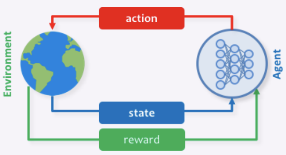

# An Introduction to Policy Gradient Methods

<https://jmichaux.github.io/week2/>

***

## Overview of Reinforcement Learning

The goal of reinforcement learning is for an agent to learn to solve a given task by maximizing 
some notion of external reward. Instead of receiving explicit instructions, the agent learns how 
to choose actions by exploring and interacting with the environment. The reward signal serves as 
a way to encode whether the actions taken by the agent were successful. By maximizing the accumulated 
reward (e.g. return) over time, the agent eventually learns how to choose the best action depending 
on their current state.

Basic reinforcement learning problems are often formulated as a *Markov Decision Process* 
$ M = \lbrace S, A, R, P, \gamma \rbrace $, where $ S $ is the distribution of states, 
$ A $ is the set of actions the agent can take,  $ R = R(s, a) $ is the reward function, 
$ P $ are the state transition dynamics, and and $ \gamma $ is the discount factor. The goal is 
**to find a policy $ \pi $ that maps states $ s \in S $ to optimal or near-optimal actions 
$ a \in A $**.

## Policy Gradients

Policy Gradient methods are a family of reinforcement learning algorithms that rely on optimizing 
a parameterized policy directly. As alluded to above, the goal of the policy is to maximize the 
total expected reward:

$$
\mathbb{E}_{\tau \sim p\theta (\tau)} [R(\tau)]. \tag{1}
$$

Policy gradient methods have a number of benefits over other reinforcement learning methods. First, 
by optimizing the policy directly, it is not required that we also learn a value function (although 
we'll later see that learning a value function can help). Second, policy gradient methods can handle 
both discrete and continuous states and actions, making them well suited for high dimensional 
problems. This is in contrast to methods such as Deep Q-learning, which struggles in high dimensions 
because it assigns scores for each possible action.

In addition to their benefits, policy gradient methods also have a few drawbacks. By definition, 
policy gradient methods are on-policy. This means that they are only able to learn from data that 
was collected with the current policy. As a result, policy gradient methods are not very sample 
efficient. Another issue is that policy gradient methods are not guaranteed to converge to a global 
optimum, and solutions may get stuck in local optima. Lastly, policy gradient methods tend to suffer 
from high variance. However, even with these drawbacks, policy gradient methods such as TRPO and PPO 
are still considered to be the state-of-the art reinforcement learning algorithms.

## REINFORCE Derivation

In deriving the most basic policy gradiant algorithm, REINFORCE, we seek the optimal policy 
$ \color{Red}{\pi^*} $
that will maximize the total expected reward:

$$
\pi^{\ast} = \underset{\pi}{\operatorname{argmax}} \mathbb{E}_{\tau \sim p{\theta}(\tau)}[R(\tau)] \tag{2}
$$

where

$$
\tau = (s_1, a_1, \dots, s_T, a_T ) \tag{3}
$$

$$
R(\tau) = \sum_{t=1}^{T}r(s_t, a_t) \tag{4}
$$

$$
p_{\theta}(\tau) = p_{\theta}(s_1, a_1, ..., s_T, a_T). \tag{5}
$$

The *trajectory* $ \tau $ is a sequence of states and actions experienced by the agent, 
$ R(\tau) $ is the *return*, and $ p_\theta (\tau) $ is the probability of observing that particular 
sequence of states and actions. It is important to note that $ p_\theta (\tau) $ is a function of both 
the environment transition dynamics and the policy $ \pi $.

Since the policy $ \pi $ is parameterized by $ \theta $ , finding the optimal policy 
$ \pi^* $ is equivalent to finding the optimal parameter vector $ \theta^{\ast} $:

$$
\theta^{\ast} = \underset{\theta}{\operatorname{argmax}} \mathbb{E}_{\tau \sim p{\theta}(\tau)}[R(\tau)] \tag{2}

\tag{6}
$$

Thus, we can define our objective 
$ J(\theta) $
 to be the total expected reward:

$$
J(\theta) = \mathbb{E}_{\tau \sim p\theta(\tau)}[R(\tau)] \tag{7}
$$

One way to optimize this objective is to take the derivative and then use gradient ascent. 
The calculation of the gradient goes as follows:

$$
\begin{eqnarray}
\nabla J(\theta) &=&  \nabla \mathbb{E}_{\tau \sim p \theta (\tau)}[R(\tau)]  \tag{8} \\
&=& \nabla \int  p \theta(\tau) R(\tau) \mathrm{d\tau}  \tag{9} \\
&=& \int \nabla  p \theta (\tau) R(\tau) \mathrm{d\tau}  \tag{10} \\
&=& \int p \theta (\tau) \nabla log p \theta (\tau) R(\tau) \mathrm{d\tau}  \tag{11} \\
&=& \mathbb{E}_{\tau \sim p\theta (\tau)}[\nabla log p \theta (\tau) R(\tau)]  \tag{12}
\end{eqnarray}
$$

