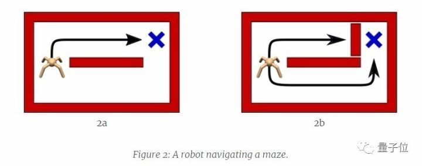
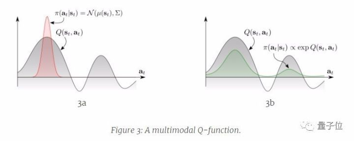
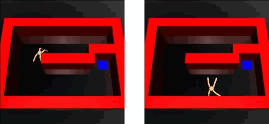
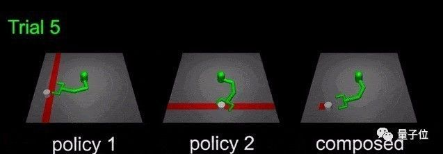
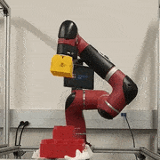

# Reinforcement Learning with Deep Energy-Based Policies
# 通过最大熵深度强化学习掌握不同的技能

Haarnoja T., Tang H., Abbeel P., Levine S. ICML 2017.

<https://arxiv.org/abs/1702.08165>

<https://github.com/haarnoja/softqlearning>

***

标准的深度强化学习，旨在掌握单一方法来解决给定的任务。但只有一种解决方案是不够的，因为智能体很容易受到现实世界中常见环境变化的影响。

例如，一个在简单迷宫中寻找目标的机器人，在训练的时候，智能体学会了从上部通道找到目标的方法，因为这个距离较短。然而之后如果我们堵住上部通道，智能体发现原来掌握的技能不可行，但不知道还可以选择下部通道。最后只能重新训练智能体。

继续以上述智能体为例。智能体反复观察当前状态（s），采取行动（a），获得奖励（r）。我们将函数Q（s，a）定义为在状态s下执行a行动之后的预期累积奖励。常规的强化学习方法是以指定最大Q值为中心的单峰策略分布，这导致下层通道完全被忽略。

另一种解决方案是确保智能体探索全部状态，同时优先考虑更有希望的状态。如上图右侧所示，这个密度具有玻尔兹曼分布的形式。这个方法让智能体掌握所有的解决方案，以应对某些方案失效的情况。作者证明，通过能量形式定义的政策是最大熵强化学习目标的最优解。

$$
\pi_{MaxEnt}^* = \arg\max_\pi E_\pi \left[ \sum_{t=0}^T r_t + H(\pi(\cdot \vert S_t ))  \right]
$$

学习这种最大熵模型的思想源自统计建模，其目标是找到具有最高熵的概率分布，同时仍然满足观察统计。在实践中，我们偏爱最大熵模型，因为它们在对观察信息进行匹配的同时，对未知数的估计最少。此前也有不少类似的研究。

我们可以通过Soft Bellman方程来获得最大熵目标的最优解。

$$
Q(s_t, a_t) = E \left[ r_t + \gamma soft\max_a Q(s_{t+1}, a) \right]
$$

此处

$$
soft\max_a f(a) \equiv \log \int \exp f(a) d a
$$

不过在连续域上仍有两个主要的挑战。首先，精确的动态规划是不可行的，其次，最优策略是由难以采样的能量分配来定义的。

解决第一个挑战，作者采用了表达神经网络函数近似，对采样状态和动作进行随机梯度下降训练，然后推广到新的状态动作元组。解决第二个挑战，采用了近似推理技术，例如马可夫链蒙特卡洛，并使用Stein变异梯度下降来加速推理。所得到的算法称为soft Q-learning。

通过soft Q-learning来学习最大熵的策略，在实践中表现如何？

作者通过实验证明，这种方法能够更好的进行探索，实现类似任务之间的策略迁移，能从现有策略中轻松组成新策略，并提高稳健性。

这里有个迁移策略的例子。两个对应不同行为的策略，将Q函数叠加在一起，能掌握新的技能。如下图所示，策略1的智能体被训练将圆柱体移动到红色竖纹的位置，策略2测试移动到红色横纹。两个策略叠加，就能让智能体把圆柱移到红点的位置。

关于稳健性作者也给了一个例子。下面这个机器人学会了拼乐高积木，即使期间被干扰，也能成功的把乐高积木拼起来。

