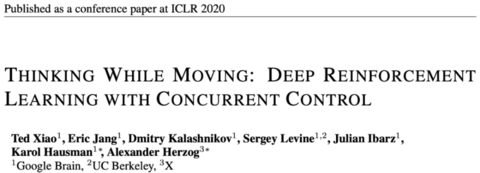
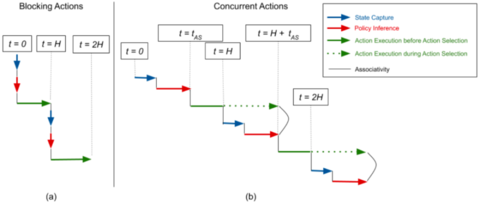
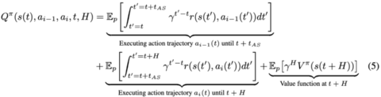
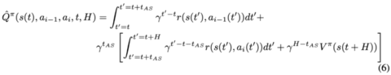
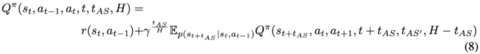
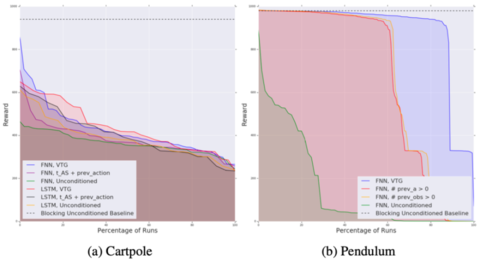
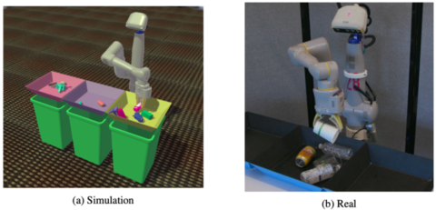
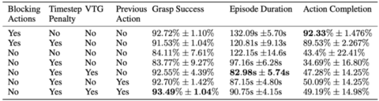
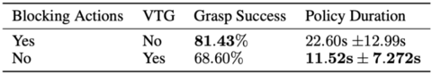

# THINKING WHILE MOVING: Deep Reinforcement Learning with Concurrent Control
# 边做边思考，谷歌大脑提出并发RL算法，机械臂抓取速度提高一倍！

作者：Ted Xiao 等

2020年05月11日 13:07 腾讯新闻

论文地址：<https://arxiv.org/abs/2004.06089>

项目网页：<https://sites.google.com/view/thinkingwhilemoving>

***

RL 算法通常假设，在获取观测值、计算动作并执行期间环境状态不发生变化。这一假设在仿真环境中很容易实现，
然而在真实机器人控制当中并不成立，很可能导致控制策略运行缓慢甚至失效。为缓解以上问题，最近谷歌大脑
与 UC 伯克利、X 实验室共同提出一种并发 RL 算法，使机器人能够像人一样「边做边思考」。目前，该论文已
被 ICLR 2020 接收。

该研究在如下情况中研究强化学习：在受控系统随着时间演变的过程中同时对动作进行采样。换句话说，所研究的机器人必须在执行着上一个动作的同时考虑下一个动作。就如同人或动物一样，机器人必须同时思考及行动，在上一个动作完成之前决定下一个动作。

为了开发用于此类并发性控制问题的算法框架，研究者从连续时间的贝尔曼方程开始，随后以考虑系统延迟的方式进行离散化。通过对现有基于价值（value-based）的深度强化学习算法进行简单的架构扩展，该团队提出了一类新型近似动态规划方法，并在模拟基准任务和大规模机器人抓取任务上进行了评估（机器人必须「边走边思考」）。

以下分别为该方法在仿真与真实机器人上的运行效果：

## 并发动作环境

下图（a）表示在阻塞环境（blocking environment）中，动作以顺序阻塞的方式执行，假设在获取状态与执行动作之间环境状态不发生变化。我们也可以将其理解为：从智能体的角度看来，获取状态与推断策略是瞬间完成的。与此相反，图（b）中表示的并发环境（concurrent environment）在获取状态与推断策略之间并没有假设环境不变，而是允许环境在此期间发生变化。

阻塞环境与并发环境中不同阶段的执行顺序对比图。

## 基于价值的连续与离散并发强化学习算法

研究者从连续时间强化学习的角度开始探索，因为它可以轻松地表示系统的并发特性。之后研究者证明，基于连续情况得出的结论同样适用于随后在所有实验中使用的更为常用的离散环境。

## 连续环境方程

为了进一步分析并发环境，研究者引入下列符号。智能体在一个周期内选择 $N$ 个动作轨迹$ ( a_1 , ..., a_N )$，
其中每个 $a_i(t)$ 为一个用于产生控制，并以时间 $t$ 作为变量的连续函数。令 $t_{AS}$ 为获取状态、推断策略
与任意额外通信时延的间隔时间。在 $t$ 时刻，智能体开始计算状态 $s(t)$ 的第 $i$ 个动作 $a_i(t)$。同时，
在时间间隔 $ (t H + t_{AS},t+t_{AS}) $ 内执行之前选取的动作 $ a_{i 1}(t) $。在 $t+t_{AS}$ 
时刻$ ( t ≤ t+t_{AS} ≤ t+H ) $，智能体切换到去执行来自 $ a_i(t) $ 的动作。并发环境下的连续 $ Q $ 函数
可表示如下：

前两项分别对应执行 $ (t,t + t_{AS} ) $ 时刻的动作 $ a_{i 1}(t) $ 和 $ (t + t_{AS}, t + t_{AS} + H) $ 
时刻动作 $ a_i(t) $ 的期望折扣回报。通过对随机方程 $ p $ 进行采样，可获得一个仅关于策略 rollouts 的单样本
（single-sample）蒙特卡洛估计器 $ Q $：

接下来，对于连续时间情形，研究者定义了一个新的并发贝尔曼 backup 算子：

以上算子将贝尔曼算子扩充为考虑并发动作的情形，研究者证明改进后的算子保持了其吸引域的特性，这对于 Q-learning 
的收敛性至关重要。

## 离散环境方程

为了简化离散情形下的符号（此时动作方程 $ a_i(t) $ 与该方程在 $ t $ 时刻的值 $ a_i(t) $ 并非必需），研究者
将当前状态设置为 $ s_t $，将当前动作设置为 $ a_t $，将上一时刻动作设置为 $ a_{t 1} $（分别将其下标 $ i $ 
替换为 $ t $）。在以上符号记法下，研究者定义了离散情形下的并发 $ Q $ 方程：

其中 $ t_{AS′} $ 为动作 $ a_t $ 在 $ t + t_{AS} $ 时刻开始执行时的「溢出间隔」（spillover duration）。
于是，并发贝尔曼算子（以下标 $ c $ 表示）为：

与连续情形类似，研究者也证明了该离散贝尔曼算子是一个吸引域。

## 实验结果

### 简单一阶控制问题

首先，研究者通过对标准的 Cartpole 和 Pendulum 环境的并发版本进行控制变量研究，说明了并发控制范式对基于价值的 DRL 方法的影响。

为了估计不同并发知识表示的相对重要性，研究者分析了每种并发知识表示对其他超参数值组合的敏感性，如下图所示：

Cartpole 和 Pendulum 环境中的实验结果。

### 大规模机械臂抓取任务

接下来，研究者分别在仿真与真实机械臂上进行了实验。

图 3：仿真和真实环境下的机械臂抓取任务图示。

表 1 通过对无条件模型与并发知识模型进行比较总结了阻塞和并发模式的性能。并发知识模型能够学习更快的轨迹，其周期持续时间与阻塞无条件模型相比减少了 31.3%。

表 1：大规模仿真机械臂抓取任务的实验结果。

此外，研究者在现实世界机器人抓取任务中，对比了并发模型和阻塞模型的定性策略行为，如图 3b 所示。

如表 2 所示，这些模型在抓取成功方面性能相当，但是就策略持续时间而言，并发模型比阻塞模型快 49%（策略持续时间用来衡量策略的总执行时间，但不包括在周期持续时间中的基础架构建立和拆除时间，并发操作无法对此优化）。

表 2：真实机械臂抓取结果。

